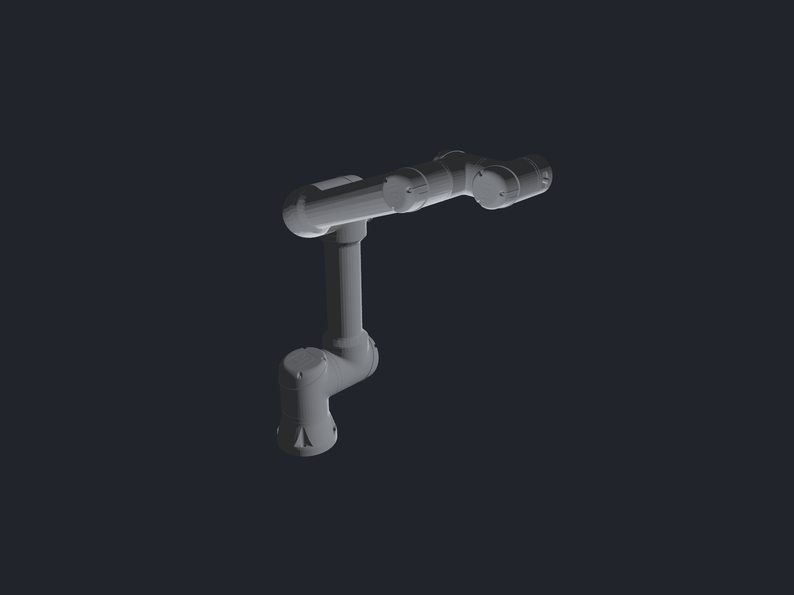
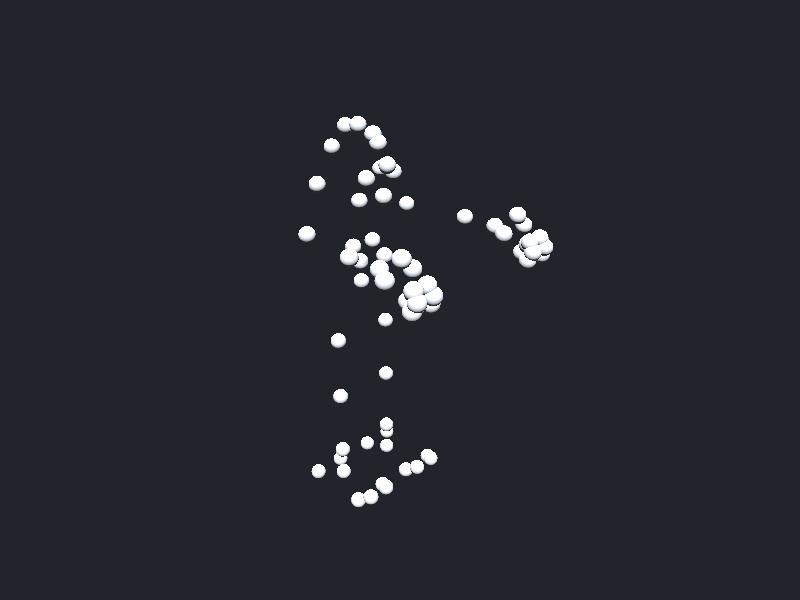

# ros-viz-rs

A generic ROS 2 robot visualizer in Rust, built on [Bevy](https://bevy.org)
and [egui](https://github.com/emilk/egui).

Because it speaks DDS directly (no rclcpp, no ROS installation), it runs
anywhere Rust runs — macOS, Windows, Linux — and in the browser via
rosbridge: **[live demo](https://victorpaleologue.github.io/ros-viz-rs/)**
(a NAO waving hello, compiled to WebAssembly).



## What it does

- Subscribes to `/robot_description` and renders the robot's URDF: boxes,
  cylinders, spheres and meshes (STL/OBJ/COLLADA), with URDF materials.
- Animates joints from `/joint_states` through proper forward kinematics
  (the [`k`](https://crates.io/crates/k) kinematics crate).
- Discovers every topic on the DDS graph and shows them in a tree panel,
  with live values and editable publishing for standard message types.
- Renders **headlessly** to PNG — no window, real GPU — for scripted checks
  and visual regression tests (`--snapshot-to out.png`).
- Ships a robot **emulator** that publishes a URDF and scripted joint states
  over real DDS, so you can demo and test with zero robots around.

Robots without meshes on disk degrade gracefully to a skeleton of markers:



## Install

```bash
cargo install ros-viz           # then run `ros-viz` (alias: `ros-viz-rs`)
```

Pre-built macOS (`.dmg`), Linux (`.deb`/`.rpm`) and Windows (`.exe`) artifacts
are attached to each [GitHub release](https://github.com/victorpaleologue/ros-viz-rs/releases).
Building from crates.io needs the usual Bevy system libraries (on Linux:
`libasound2-dev libudev-dev libwayland-dev libxkbcommon-dev`).

## Quick start

```bash
# Visualize whatever robot lives on your ROS domain
cargo run                       # domain 0, or ROS_DOMAIN_ID, or --domain N

# Resolve package:// mesh URIs against local directories
cargo run -- --package my_robot_description=/path/to/package

# Headless snapshot of a live robot (no window opens)
cargo run -- --snapshot-to robot.png

# No robot around? Watch the embedded NAO wave
cargo run -- --demo

# Or connect through a rosbridge server instead of DDS
cargo run -- --rosbridge ws://localhost:9090

# View a URDF file directly, no ROS at all
cargo run --example urdf_view -- test-data/urdf/simple_arm.urdf
cargo run --example urdf_view -- robot.urdf --joint elbow_joint=1.2 \
    --export-snapshot out.png

# Print forward-kinematics world positions for a URDF
cargo run --example fk_probe -- robot.urdf shoulder_lift_joint=-1.57
```

Robots whose meshes aren't on disk render as a skeleton of markers. To see
the real NAO meshes, install them once (they're CC BY-NC-ND, so not bundled
here) and point `--package` at them:

```bash
# the official installer; see github.com/ros-naoqi/nao_meshes2
cargo run --example urdf_view -- assets/nao_robot.urdf \
    --package nao_meshes=/path/to/nao_meshes
```

More tools live in [examples/](examples/) (topic watching, URDF download).

## Testing philosophy

Everything is checked headlessly by `cargo test` — including rendering:

- The [snapshot module](src/snapshot.rs) renders offscreen (render-to-texture
  plus GPU readback, no window) inside ordinary tests.
- The [vision module](src/vision.rs) compares pixels in pure Rust: RMSE
  against reference images, silhouette coverage and framing checks.
- [tests/visual_regression.rs](tests/visual_regression.rs) renders the URDF
  fixtures and fails on visual drift; regenerate references after intended
  changes with `ROS_VIZ_BLESS=1 cargo test --test visual_regression`.
- [tests/ros_e2e.rs](tests/ros_e2e.rs) runs the *whole* pipeline: emulator
  publishes over DDS → app receives URDF + joint states → GPU render →
  pixel assertions.

## Development

```bash
cargo fmt && cargo clippy --all-targets -- -D warnings && cargo test
```

CI runs the same on Linux and macOS. Every PR must bump the version in
Cargo.toml; merging to main auto-tags and publishes a GitHub release with
macOS (.dmg), Linux (.deb) and Windows (.exe) artifacts.

- Architecture notes: [docs/wiki/Architecture.md](docs/wiki/Architecture.md)
- Maintainer setup (secrets, releases): [docs/MAINTAINER.md](docs/MAINTAINER.md)
- Living plan: [CURRENT_PLAN.md](CURRENT_PLAN.md)
- Issues: <https://github.com/victorpaleologue/ros-viz-rs/issues>

## License

[MIT](LICENSE) — free to use, including commercially.

Sample robot descriptions used in tests keep their upstream licenses
(e.g. the UR description is BSD-3-Clause; NAO meshes are CC BY-NC-ND 4.0 and
are downloaded from [ros-naoqi](https://github.com/ros-naoqi/nao_meshes2)
at test time, never redistributed here).
